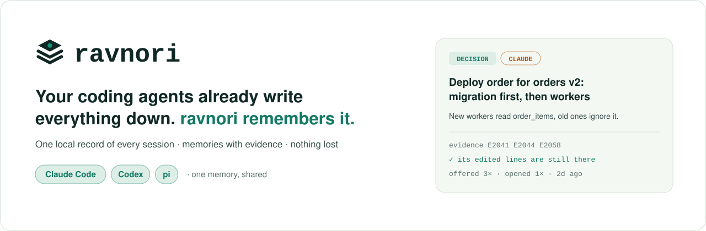
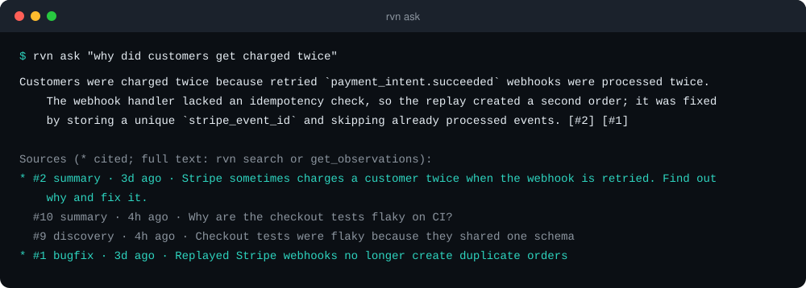
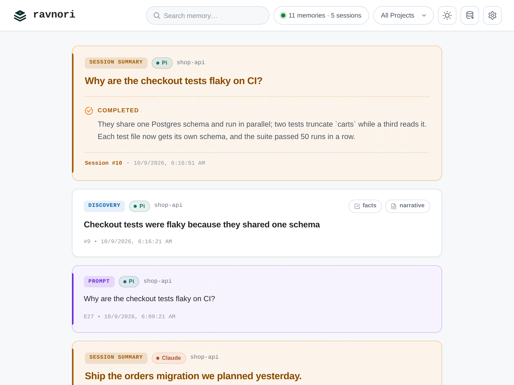
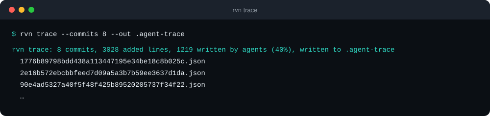
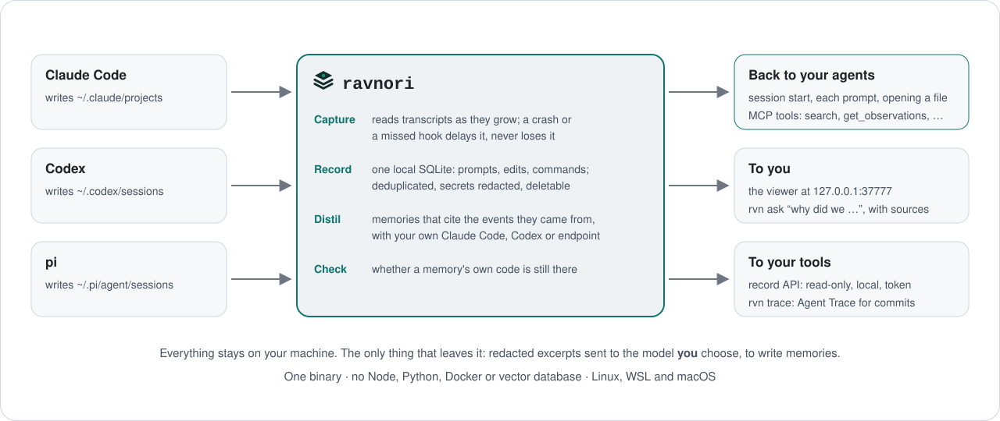

<p align="center">
  <picture>
    <source media="(prefers-color-scheme: dark)" srcset="docs/assets/hero-dark.svg">
    
  </picture>
</p>

<p align="center">
  <a href="https://github.com/daefery/ravnori/releases/latest"></a>
  <a href="https://github.com/daefery/ravnori/actions/workflows/ci.yml"></a>
  <a href="LICENSE"></a>
  
</p>

<h3 align="center">Ask why your code is the way it is. ravnori answers from your coding agents' own sessions, with sources.</h3>

<p align="center">
  ravnori keeps a complete local record of every <b>Claude Code</b>, <b>Codex</b> and <b>pi</b>
  session, read from the transcripts they already save. Every memory shows where it came
  from, each agent starts with what the others learned, and no session goes missing
  because a hook failed.
</p>

<p align="center">
  <a href="#install">Install</a> ·
  <a href="#try-it-first-without-changing-anything">Try it first</a> ·
  <a href="#what-you-get">What you get</a> ·
  <a href="#how-it-works">How it works</a> ·
  <a href="#privacy">Privacy</a> ·
  <a href="#faq">FAQ</a>
</p>

```sh
curl -fsSL https://github.com/daefery/ravnori/releases/latest/download/install.sh | sh
```

## Why ravnori

Three weeks after an agent changed your code, you want to know why. The chat is gone, and
the commit message says "fix tests".

Most memory tools can't help, because they write a summary while you work, through a hook
that has to succeed, and keep only the summary. When the hook misfires or the model is
busy, that session is never saved, and nothing tells you.

ravnori works from the transcripts instead. Claude Code, Codex and pi already save every
prompt, command and edit to disk. ravnori reads those files, so:

- **No session goes missing.** A crash, a skipped hook or a model outage only delays a
  memory. On the author's machine ravnori re-read 1.45 GB of transcripts from scratch with
  zero duplicates, and `rvn doctor` tells you exactly how far behind it is.
- **Every answer has a source.** Each memory points to the transcript lines it came from.
  `rvn ask "why did we..."` or `rvn ask "what did we do yesterday"` answers from the
  record and lists what it used, so you can check.
- **Old memories say they're old.** Each one knows whether the code its session wrote is
  still in your repository. On ravnori's own repo, 75% of the lines agents wrote last month
  are still there; memories about the rest say so, so they don't send your agent the
  wrong way.
- **Your agents share one memory.** A Codex session hears what Claude Code did in the same
  project an hour ago.
- **You see which lines an agent wrote,** even in commits from before you installed it.

It runs on the Claude Code or Codex sign-in you already have. One binary, no server, no
Node, Python, Docker or vector database.

## Install

One line for Linux (x86_64, arm64), WSL and macOS. No Rust needed.

```sh
curl -fsSL https://github.com/daefery/ravnori/releases/latest/download/install.sh | sh
```

The script downloads the binary for your system, checks its SHA-256 and puts it in
`~/.local/bin`. Then it connects Claude Code, Codex and pi, backing up each settings file
first, and starts a small background service that writes memories with your Claude Code
or Codex sign-in. Keep working as usual. After your first session:

```sh
rvn doctor        # ends with "status: OK"
```

The viewer is at **http://127.0.0.1:37777**.

> **Using Codex?** Codex runs no hook until you trust it. Open Codex, type `/hooks` and
> trust ravnori's three hooks. Until then your Codex sessions are still recorded, they just
> don't get memories back. `rvn doctor` reminds you.

> **Used mnem before?** ravnori is its new name, and the command is now `rvn`. Install it
> the same way: it moves your memory from `~/.mnem` to `~/.ravnori` and replaces mnem's
> hooks, tools and service. `mnem` keeps working as a link to `rvn` until 0.7.0.
> [What changes](docs/reference.md#upgrading-from-mnem).

### Try it first, without changing anything

Want to see what ravnori finds before it touches your setup? This installs only the binary
and reads your existing transcripts into its own folder. Your agents' settings stay
exactly as they are.

```sh
curl -fsSL https://github.com/daefery/ravnori/releases/latest/download/install.sh | RAVNORI_NO_SETUP=1 sh
~/.local/bin/rvn backfill                  # read every saved session
~/.local/bin/rvn search "flaky test"       # search all of them, across agents
~/.local/bin/rvn doctor                    # what was found, per agent
```

To undo it, delete `~/.local/bin/rvn` and `~/.ravnori`. To keep it, run `rvn install --watch`.

<details>
<summary><b>Or as a Claude Code plugin</b></summary>

```
/plugin marketplace add daefery/ravnori
/plugin install ravnori@ravnori
/ravnori:setup
```

`/ravnori:setup` installs the program with the same script. If you also ran the one-line
installer, the plugin's copies stay quiet, so nothing runs twice.
</details>

<details>
<summary><b>Or build from source</b></summary>

```sh
git clone https://github.com/daefery/ravnori && cd ravnori
cargo install --path . --locked --features fastembed
rvn install --watch
```

Needs Rust 1.89 or newer. `--features fastembed` adds the local model used for
meaning-based search.
</details>

<details>
<summary><b>Options and older systems</b></summary>

- `RAVNORI_VERSION=v0.6.0` picks a release, `RAVNORI_BIN_DIR` another folder, and
  `RAVNORI_NO_SETUP=1` installs only the binary.
- Linux with glibc 2.35 to 2.38 (Ubuntu 22.04, Debian 12) and Intel Macs get a "lite"
  build: the same ravnori, with a smaller model for meaning-based search.
- Windows: use WSL.
- The background service downloads the search model once (about 90 MB).
</details>

## What you get

### Answers about past work, with sources

<p align="center"></p>

`rvn ask` answers only from what it found and lists every source it cited: memories,
your pinned facts, what you typed and what your agents replied. If they don't cover the
question, it says so.

- **Why:** "why did we drop the merge button?" It says whose reason it was: when you only
  said "go" to an agent's suggestion, the answer reads "the agent recommended it because
  …; you chose it", not a reason you never gave. A later "still open" from you outweighs
  an older note that calls it decided.
- **When:** "what did we do yesterday?", "what shipped on 4 October?", "last week",
  "kemarin". Read in your local time, across every project unless you name one, with
  shipped work first. It works on the first day too, before any memory is written.
- **Your agents ask it too.** The MCP tool `ask` (and pi's `ravnori_ask`) lets an agent
  answer "what did we decide about X?" from the record instead of digging through git log.

### Memory that shows up on its own

You don't call anything. When a session starts, when you type a prompt and when the agent
opens a file, ravnori adds the few memories that match:

```text
ravnori recall: past memories matching this prompt (full text: get_observations([ids]))
#2 summary · 3d ago · Stripe sometimes charges a customer twice when the webhook is retried. Find out why and fix it.
#1 bugfix · 3d ago · Replayed Stripe webhooks no longer create duplicate orders
```

Opening a file brings the memories about that file, each noting whether its edits are
still there. Agents can also search on their own through ravnori's MCP tools, and
`rvn remember "..."` pins a fact every agent sees at session start.

### A live view of every agent

<p align="center">
  <picture>
    <source media="(prefers-color-scheme: dark)" srcset="docs/assets/viewer-dark.png">
    
  </picture>
</p>

Every agent's prompts and memories as they happen. Search them, filter by project, take
a backup, or fix an agent that isn't connected with one click.
(The screenshots use a made-up project: [docs/demo](docs/demo/make-demo.py).)

### Which lines did an agent write?

<p align="center"></p>

`rvn trace` writes [Agent Trace](https://agent-trace.dev) records for your commits:
which added lines came from which agent session and model. It covers commits from before
you installed anything, because the transcripts already hold every edit. Useful in code
review, and for teams with rules about AI-written code.

### Build your own tools on it

A local, read-only API serves the whole record, so your scripts skip parsing three
transcript formats:

```sh
rvn api        # prints the address and token
curl -s -H "Authorization: Bearer $(cat ~/.ravnori/api-token)" \
  "http://127.0.0.1:37777/v1/search?q=webhook+retries"
```

Sessions, events, memories with their evidence, and search, paged so a tool can sync.
See [docs/api.md](docs/api.md).

## How it works

<p align="center">
  <picture>
    <source media="(prefers-color-scheme: dark)" srcset="docs/assets/how-dark.svg">
    
  </picture>
</p>

1. **Capture.** Each agent appends prompts, answers, commands and edits to a transcript
   file. ravnori reads each file as it grows and saves its place in the same database write,
   so nothing is skipped or read twice.
2. **Distil.** After each turn, and in the background for anything missed, your own model
   turns the session into short memories that cite the lines behind them.
3. **Recall.** Hooks put the best few memories in front of the agent at the right moment,
   ranked by words and by meaning with a local model, and never repeated in a session.

## Privacy

Everything stays on your machine: the record, the memories, the search model, the viewer
and the API. There is no ravnori server.

Secrets are removed before anything is stored: API keys, tokens, passwords in URLs.

Two things leave your machine. To write memories, redacted excerpts go to the model you
chose, by default your own Claude Code or Codex sign-in. And the background service
downloads its search model once from Hugging Face.

`rvn forget` deletes a memory, a session or a whole project for good.
`rvn uninstall` disconnects your agents and keeps your data until you delete `~/.ravnori`.

## Everyday commands

| Command | What it does |
|---|---|
| `rvn doctor` | Is every session captured? Which agents are connected? Anything to fix? |
| `rvn ask "..."` | Answer a question about past work (why, when, what shipped), with sources |
| `rvn search <words>` | Search everything captured |
| `rvn remember "..."` | Pin a fact every agent sees at session start |
| `rvn forget <id>` | Delete a memory, session or project for good |
| `rvn backup` / `rvn restore` | Verified snapshots (taken daily by default); `--merge` adds a teammate's memory to yours |
| `rvn trace` | Agent Trace records for this repository's commits |
| `rvn api` | The record API's address and token |
| `rvn install` / `rvn uninstall` | Connect or disconnect your agents |

Every command, setting and measurement is in [docs/reference.md](docs/reference.md).

## How it compares

| | ravnori | Tools that write memories during the session |
|---|---|---|
| A hook or model call fails | the memory waits; the session is read again from its transcript | that session's memory can be lost |
| Where a memory came from | points to the transcript lines | not kept by the tools we checked |
| Is its code still there? | checked for each memory | not tracked by the tools we checked |
| Agents | Claude Code, Codex and pi, one shared memory | some cover more (up to 9) |
| What you run | one binary | often Node, Python or a vector database |

Thirteen tools compared in detail, with sources: [the comparison and roadmap](https://daefery.github.io/ravnori/comparison.html).

## FAQ

<details>
<summary><b>Will it slow my agent down?</b></summary>

Rarely enough to notice. On the author's machine over the past two weeks, the prompt
hook took 26 ms at the median and 167 ms for the slowest 5%. Memories are written after
the turn, in the background.
</details>

<details>
<summary><b>Does it use my Claude or ChatGPT plan?</b></summary>

Yes, if you write memories with your Claude Code or Codex sign-in, which is the default.
One request covers about 16,000 characters of a finished session, so a short session takes
one and a long one several. All background requests together stop at 100 a day. Sessions
past that wait for the next day; none are lost, and `rvn doctor` tells you. You can use
any OpenAI-compatible endpoint instead.
</details>

<details>
<summary><b>Do agents actually use the memories?</b></summary>

Not as often as they should, yet. Judges rate about two thirds of the memories ravnori shows
as helpful, but agents open fewer than 1 in 10. Better ways to present them are being
tested and measured now ([roadmap](https://daefery.github.io/ravnori/comparison.html#roadmap)).
The record, the sources and `rvn ask` work either way.
</details>

<details>
<summary><b>I already use claude-mem.</b></summary>

`rvn import` brings in your claude-mem history with its ids. ravnori can also recover
sessions claude-mem never saved, from the transcripts still on disk. Try it first with
the no-changes steps above.
</details>

<details>
<summary><b>How do I remove it?</b></summary>

Run `rvn uninstall`, then delete `~/.local/bin/rvn`. To remove your data too, delete
`~/.ravnori`.
</details>

## Contributing

Issues and pull requests are welcome. Changes to recall are measured before they ship
(`rvn eval --gate`); see [CONTRIBUTING.md](CONTRIBUTING.md).

## License

ravnori is free software under the [GNU AGPL v3.0](LICENSE). Use it, change it and share it,
at work too. If you distribute a modified ravnori, or run one as a service for others, share
your changes under the same license. A commercial license is available for uses the AGPL
doesn't suit.
